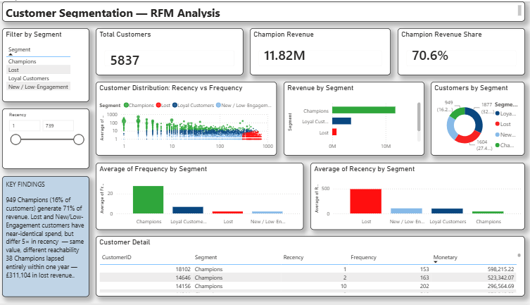

# Customer Segmentation — RFM Analysis

Segmenting 5,837 retail customers by purchasing behaviour using RFM metrics and K-Means clustering, with SQL-based feature engineering and an interactive Power BI dashboard.

## Problem

A UK online retailer with limited marketing budget needs to know which customers justify retention spend, which need nurturing, and which are unlikely to return.

## Dataset

UCI Online Retail II — 1,067,371 transaction line items, December 2009 to December 2011. Each row represents one product on one order.

Raw and cleaned transaction files are excluded from the repository for size. The source file is available from the UCI Machine Learning Repository; `retail_clean.csv` is regenerated by running `notebooks/1_eda.ipynb`.

## Data Cleaning

| Issue | Rows | Action | Rationale |
|---|---|---|---|
| Missing Customer ID | 243,007 | Dropped | RFM requires customer-level attribution |
| Price ≤ 0 | 6,207 | Dropped | Not genuine transactions |
| Negative quantity, invoice prefix "C" | 19,493 | Retained | Genuine customer returns; netting them out gives truer lifetime value |
| Negative quantity, no prefix | 3,457 | Dropped | Inventory adjustments rather than customer behaviour |

Final: 824,293 transactions across 5,939 customers.

## Limitation: Non-Random Missingness

The 243,007 dropped transactions averaged £10.86 versus £20.20 for retained ones, indicating they represent guest checkouts rather than a random sample. The segmentation therefore describes registered, identifiable customers rather than total purchasing activity. This is acceptable for the objective — marketing can only target known customers — but segment sizes should not be read as representative of all shoppers.

## Method

**RFM computation (SQL)**
Recency, Frequency, and Monetary calculated per customer in MySQL using a CTE for the reference date, `DATEDIFF` for recency, and `COUNT(DISTINCT Invoice)` to count orders rather than line items. Reference date set to 2011-12-10, one day after the final transaction.

824,293 rows loaded via `LOAD DATA INFILE` (14 seconds) rather than the import wizard.

**Preprocessing**
Monetary ranged from £3 to £598,215 — a single wholesale customer roughly 200× the mean. Frequency and Monetary were log-transformed to compress this skew, then all three features standardised. 102 customers with net negative Monetary were removed.

**Cluster selection**
Silhouette peaked at k=2 (0.418) and declined steadily, but two segments are not actionable for marketing. The elbow plot flattened around k=4, whose silhouette (0.363) remains close to k=3 (0.400). k=4 was selected. No score exceeded 0.42, indicating customer behaviour is closer to a continuum than a set of naturally distinct groups — these segments are useful constructs rather than sharp natural divisions.

## Results

| Segment | Customers | % of Base | % of Revenue | Avg Recency | Avg Frequency | Avg Spend |
|---|---|---|---|---|---|---|
| Champions | 949 | 16.3% | 70.6% | 40 days | 27.6 | £12,455 |
| Loyal Customers | 1,877 | 32.2% | 21.0% | 98 days | 6.6 | £1,877 |
| Lost | 1,604 | 27.5% | 4.8% | 491 days | 2.0 | £500 |
| New / Low-Engagement | 1,407 | 24.1% | 3.6% | 103 days | 2.0 | £426 |

**16.3% of customers generate 70.6% of revenue.**

**Lost and New/Low-Engagement have near-identical Frequency (2.0 orders) and comparable Monetary (£500 vs £426), separated almost entirely by Recency (491 vs 103 days).** Same value, different reachability — identical treatment would waste budget on 1,604 customers unlikely to return.

## Validation

**Cluster stability.** K-Means was run across 10 random initialisations and compared using Adjusted Rand Index. Mean ARI 0.989 (min 0.986) — roughly 99% of customers land in the same segment regardless of initialisation. Combined with the modest silhouette score, this indicates soft boundaries but stable structure.

**Baseline comparison.** Segments were compared against traditional RFM quartile scoring, which requires no machine learning. The two agree at the extremes — 938 of 949 Champions score 10-12, and 1,581 of 1,604 Lost score 3-7 — but diverge in the middle. RFM score 8 alone contains 616 customers spread across all four K-Means segments, because summing R, F, and M discards which dimension drove the score. A customer with R=1, F=3, M=4 (lapsed but formerly valuable) and one with R=4, F=2, M=2 (recent but low-value) both score 8 despite requiring opposite interventions. K-Means adds most value in the mid-range, where most customers sit.

**Segment migration.** Stability across random seeds says nothing about stability across time, so transactions were split into two one-year windows (Dec 2009–Dec 2010, Dec 2010–Dec 2011) with K-Means fitted on period 1 and applied to period 2 via predict, keeping both periods on the same cluster centres. Among the 2,681 customers active in both windows, retention on the diagonal was 56.1% for Champions, 47.8% Loyal, 47.0% New/Low-Engagement, 42.2% Lost. The largest single movement was Champions to Loyal at 33.3% — Champions erode rather than collapse, with only 5.5% falling directly to Lost. Champions are replenished almost entirely from Loyal (10.5% upgrade rate); New/Low-Engagement converts upward at 25.8% to Loyal but only 1.9% to Champions, while 25.3% fall to Lost.

A further 38 period-1 Champions did not transact at all in period 2, representing £311,104 of lapsed revenue. These sit outside the migration grid, since total disappearance is not a destination state — meaning the diagonal measures retention conditional on returning, not absolute retention. Roughly 3,164 customer-periods appeared in only one window and were excluded from the join. As with the dropped Customer IDs, this exclusion is not random: excluded customers averaged £849 versus £2,624 for those retained, a threefold gap. Customers active in only one window are typically either newly acquired or already lapsed, so the migration rates describe the most engaged portion of the base rather than the customer body as a whole.
Note that one-year windows compress all three RFM dimensions relative to the two-year headline analysis (period-level Champions average 19 orders versus 27.6), so these segments are period-level constructs rather than the same entities as the main segmentation.

## Business Implication

Reaching all 949 Champions at an assumed £50 per customer costs £47,450. At an average Champion value of £12,455, preventing 3.8 defections covers the cost — a 0.4% success rate breaks even. The same budget spent on New/Low-Engagement customers would need to retain 111 customers to break even. The £50 figure is an assumption; the ratio is the point. Migration analysis puts this in context: 38 Champions lapsed entirely within a single year, ten times the 3.8 defections required for the campaign to break even.

## Dashboard



Interactive Power BI report with segment and recency slicers, a log-scaled scatter plot showing all 5,837 customers coloured by segment, revenue concentration by segment, and a sortable customer detail table.

## Project Structure

```
customer_segmentation/
├── data/
│   ├── rfm.csv
│   ├── rfm_segments.csv
│   └── segment_migration.csv
├── images/
│   └── dashboard.png
├── notebooks/
│   ├── 1_eda.ipynb
│   ├── 2_clustering.ipynb
│   └── 3_migration.ipynb
├── sql/
│   └── rfm_analysis.sql
├── segmentation_dashboard.pbix
├── .gitignore
└── README.md
```

## Tools

Python (pandas, scikit-learn, seaborn, matplotlib) · MySQL · Power BI